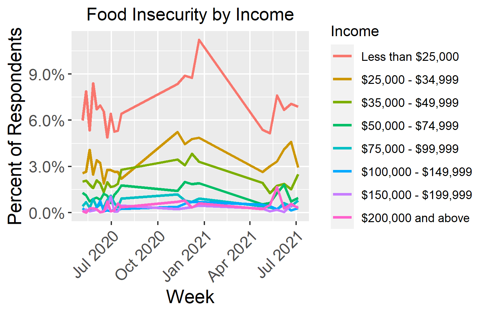

# Food Insecurity During the COVID-19 Pandemic
## Project Overview
### Background
Food insecurity can be defined as a lack of consistent access to adequate and nutritious food that meets the dietary needs and food preferences of an individual (Niles et al., 2020). Food insecurity can lead to serious negative health outcomes such as diabetes, high blood pressure, heart disease, and mental health challenges (Niles et al., 2020). Trends in food insecurity tend to parallel trends in unemployment, poverty, and food prices (Niles et al., 2020). The COVID-19 pandemic and the subsequent social distancing efforts have caused disruption in food systems which has had serious food security implications (Fitzpatrick et al., 2020; Niles et al., 2020). The purpose of the current project was to explore trends in food insecurity during the COVID-19 pandemic, as well as gather research on the topic. 

### Data and Tools
The data used for the visualizations in this project was obtained from [Kaggle](https://www.kaggle.com/datasets/jackogozaly/pulse-survey-food-insecurity-data). The Kaggle dataset was an aggregation of data from the [United States Census Bureau's Household Pulse Survey](https://www.census.gov/programs-surveys/household-pulse-survey/data.html). 

The US Census Household Pulse Survey is a 20-minute online survey which was designed to collect data on how people's lives have been impacted by the COVID-19 pandemic. Phase 1 of the survey began on April 23, 2020, and subsequent phases followed (it is currently on phase 3.4). The first phase of the survey was disseminated/collected on a weekly basis, while the phases that followed were disseminated/collected using two-week periods. After the data is collected, it is used to calculate estimates for the total number of persons who are over 18 years old and live within housing units (US Census Bureau). For more information on the source of the data and the accuracy of the estimates, the US Census Bureau publishes a "Source and Accuracy Statement" for each phase. The statement for the most recent phase can be found [here](https://www2.census.gov/programs-surveys/demo/technical-documentation/hhp/Phase3-4_Source_and_Accuracy_Week43.pdf). 

The Household Pulse Survey collected information on various topics, one being Food Sufficiency/Food Security. The data used for this project was obtained from the "Food Sufficiency for Households, in the Last 7 Dyas, by Select Characteristics" tables. The data was stored in excel files that contained roughly 67 sheets each. The data was not in a tidy format, and simply showed counts for each food sufficiency reponse per reponse in another category. Because of this, when all of the files were combined into a tidy format, it resulted in a data set where each row represented one response option in one category, rather than representing all of the responses from an individual survey participant. While the survey is still ongoing, the data that was merged to form the Kaggle dataset spans from April 4, 2020 to August 23, 2021.

To create the visualizations, R was used in RStudio in combination with the ggplot2 package. The code for this project can be found [here](Covid_Food_Security_Script.R). 

## Demographic Groups
Previous analyses provide evidence to the fact that food insecurity is not evenly spread throughout the country or across racial and ethnic groups (Fitzpatrick et al., 2020). For example, prior to the COVID-19 pandemic, wide disparities in food insecurity already existed, with elevated rates for poor households, households with children, single-parent households, people living alone, and Black- and Hispanic-headed households (Fitzpatrick et al., 2020). Fitzpatrick (2020) points out that it is important to pay special attention to these vulnerable groups, as these disparities may have widended during the current pandemic. In the study done by Fitzpatrick (2020), it was found that adult food insecurity in the United States had become significantly elevated during the pandemic, and that individuals who are low income, parents, and Black and/or Hispanic had a higher prevalence of food insecurity. 

The first visualization charts the percent of repondents in various racial groups who reported that they either *sometimes* did not have enough to eat or *often* did not have enough to eat. From the chart, it is evident the rate of food insecurity was highest in the Black, Hispanic, or multiracial/other groups.    

    

To try to more easily visualize differences in the racial groups and to examine the most severe cases of food insecurity, the next visual charts only the percent of repondents who reported that they *often* did not have enough to eat. The disparities between the racial groups are still prevalent, but somewhat less so than the previous graph. Both graphs exhibit a spike at the beginning of the pandemic as well as a spike around January 2021. This January spike may be due to a surge in COVID-19 cases that happened during that time, which may have led to various food sources being closed/inaccessible. 

 
   

    
*Obtained from [Our World in Data](https://ourworldindata.org/covid-cases). 

In addition to exploring disparities in food insecurity rates among racial groups, 
     

     

## Employment
  

    

        

## Mental Health
    

    

    

    

## Limitations

## Need Help? 
Do you need help getting food? If so, clicking on the link below will take you to the Feeding America food bank locator.

Feeding America Food Bank Locator : https://www.feedingamerica.org/need-help-find-food

From the Feeding America Website: 
> Even if a food bank looks far away, they can help you find food closer to home. Search by zip code or state using the food bank locator, and contact the food bank that serves your area.

>Food assistance is free, comfortable, and confidential. However, you may need to complete some paperwork when you check-in.

>Low or no contact options are also available in many areas, including seniors-only hours, drive-through pantries, expanded home delivery services, and more.

## References
